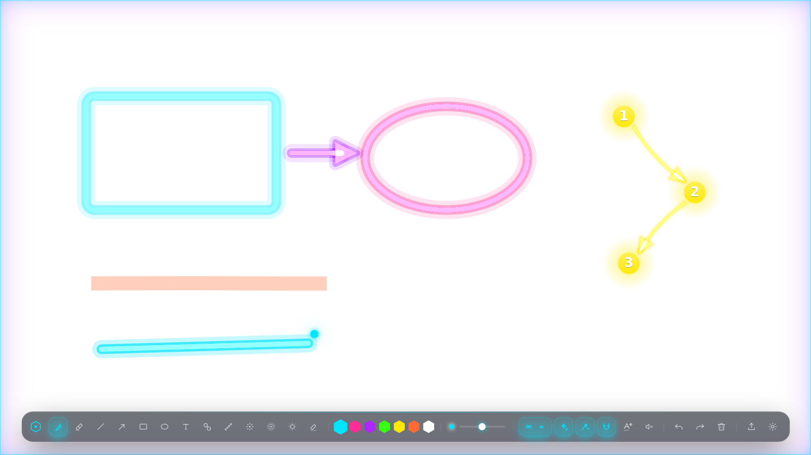
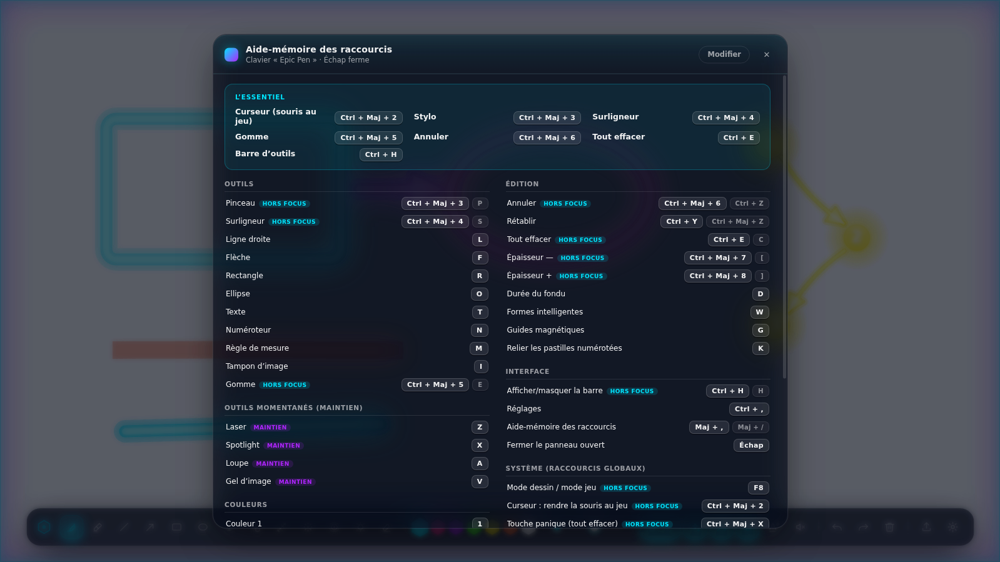
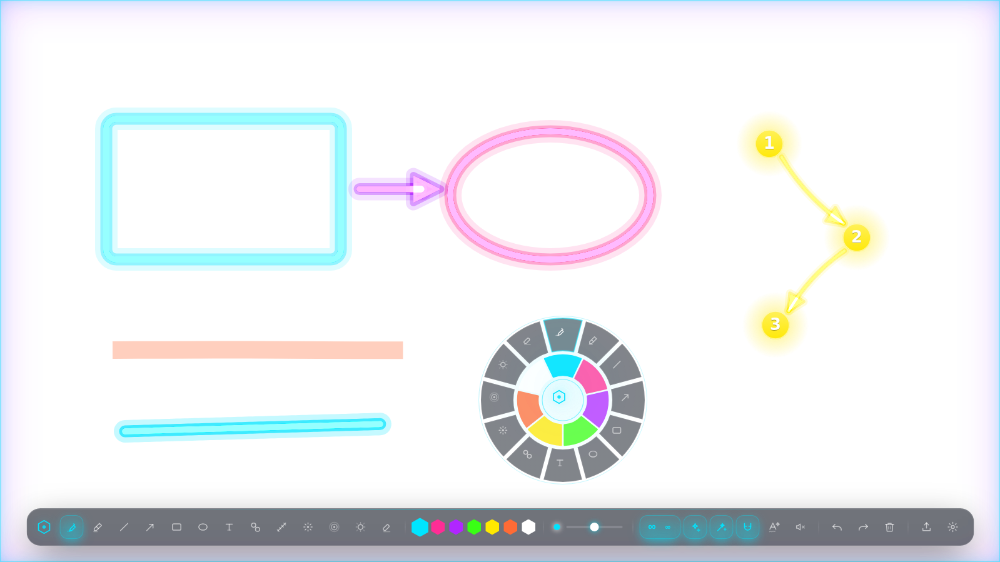

<div align="center">

# Hexa

### Dessine sur ton écran. En direct. Devant tout le monde.

**[⬇ Télécharger Hexa pour Windows](https://github.com/skyyartconcours-ai/Hexa/releases/latest)**

Tu appuies sur une touche, tu dessines par-dessus ton jeu, c'est magnifique,
ça s'efface tout seul, et ton jeu ne perd pas une image par seconde.

Gratuit · Windows 10 et 11 · Fonctionne entièrement hors ligne · Aucun compte

**[Installer en 3 étapes](docs/INSTALLATION.md)** · **[Mode d'emploi](docs/GUIDE.md)**

</div>

---

<div align="center">
  
</div>

---

## Ce que c'est

Hexa est une couche invisible posée sur ton écran. Tu appuies sur **F8**, un liseré lumineux
s'allume, et tout ton écran devient une feuille : ton jeu, une vidéo, un tableur, un site web.
Tu dessines, tu montres, tu expliques. Tu réappuies sur F8 et la souris repart dans ton jeu comme
si de rien n'était.

C'est fait pour les streamers, les coachs et les profs. Pour le moment où il faut entourer *ça*,
tout de suite, sans casser le rythme.

**Tu viens d'Epic Pen ? Tes raccourcis fonctionnent déjà.** `Ctrl+Maj+3` stylo, `Ctrl+Maj+4`
surligneur, `Ctrl+Maj+5` gomme, `Ctrl+E` tout effacer. Rien à réapprendre, et tout est
remplaçable si tu veux tes propres touches.

## En quoi c'est mieux qu'Epic Pen

|  | Epic Pen | **Hexa** |
| --- | --- | --- |
| **L'écran finit sale** | tu effaces à la main | **il se nettoie tout seul** : 2 s, 4 s, 8 s, ou ∞ si tu veux un tableau |
| **La qualité du trait** | un trait plat, façon Paint | trait lissé qui s'épaissit avec la vitesse, halo néon en trois passes |
| **Les formes** | tu vises et tu tremblotes | **formes intelligentes** : ton rectangle bancal se redresse tout seul, et un Ctrl+Z te rend le tracé d'origine |
| **L'écriture** | ton gribouillis reste un gribouillis | **écris à la main, Hexa le retranscrit en typographie nette** |
| **Choisir un outil** | viser la barre d'outils | **menu radial** : clic droit maintenu, tu glisses, tu relâches — sans quitter l'action des yeux |
| **Corriger** | effacer et recommencer | **clic droit sur une annotation et tu la déplaces** |
| **Le style** | une barre grise | **8 thèmes complets**, du néon au terminal vert, du pastel au quasi-invisible |
| **OBS** | ce que voit ton écran | **une couche dédiée pour OBS** : tes spectateurs voient tout, ton écran peut rester propre |
| **Après coup** | rien | **rejeu horodaté** de la session, export PNG transparent jusqu'en 4× |
| **Le coût pour ton jeu** | une couche composée en permanence | **la fenêtre se cache dès qu'elle est vide** : 0 image dessinée, 0 % de processeur au repos |
| **Le prix** | payant pour la version complète | **gratuit, et sans connexion** |

## Ce qu'il y a dedans

**Onze outils** — stylo, surligneur, ligne, flèche, rectangle, ellipse, texte, numéroteur à
pastilles reliées (1 → 2 → 3), règle de mesure, tampon d'image (Ctrl+V colle ta capture), gomme
par trait entier. Plus le **laser** et le **projecteur**, à maintenir, pour montrer sans laisser
de trace.

**Ça s'efface tout seul.** Chaque annotation se dissout en traînée de comète après 2, 4 ou
8 secondes — ou jamais, en **mode ∞**, quand tu veux construire un schéma pièce par pièce.

**Des guides magnétiques** qui alignent les formes entre elles et calent les angles remarquables,
sans jamais t'empêcher de dessiner de travers si c'est ce que tu veux (Alt les suspend).

**Tout au clavier**, et remappable jusqu'au dernier raccourci, avec un aide-mémoire à l'écran
(touche `?`) et un garde-fou qui refuse les combinaisons qui casseraient ton système.

**Quatre profils** livrés — Analyse LoL, Masterclass, Coaching live, Discret — et tu peux
enregistrer les tiens.

**Aucune connexion.** Aucun compte, aucune télémétrie, aucune police téléchargée. Tout ce qui
s'affiche est dessiné par le programme lui-même. Débranche Internet, Hexa s'en moque.

<div align="center">
  
  <br><em>L'aide-mémoire, touche <code>?</code> — les raccourcis Epic Pen sont là dès le premier lancement.</em>
</div>

<div align="center">
  
  <br><em>Clic droit maintenu : la roue s'ouvre sous ton curseur. Tu glisses, tu relâches, c'est pris.</em>
</div>

## Par où commencer

- **[Installer Hexa en 3 étapes](docs/INSTALLATION.md)** — télécharger, passer l'avertissement de
  Windows, trouver l'icône. Écrit pour quelqu'un qui n'a jamais rien installé de compliqué.
- **[Le mode d'emploi](docs/GUIDE.md)** — tous les raccourcis, le mode ∞, le menu radial,
  la configuration d'OBS, et une section « ça ne marche pas ? » qui règle les vrais problèmes.

---
---

# Partie développeur

*Tout ce qui suit ne concerne que le développement de Hexa. Si tu veux juste l'utiliser,
les deux liens ci-dessus suffisent — tu n'as besoin d'aucune ligne de commande.*

## Démarrer

```bash
npm install
npm run dev            # démo navigateur : http://localhost:5173
npm run app            # l'overlay Electron réel, sur le build de production
npm run app:dev        # l'overlay Electron sur le serveur de dev
npm run dist           # fabrique l'installateur Windows dans release/
```

La démo navigateur fait tout, sauf ce qui exige le système : dessin, outils, thèmes, réglages,
rejeu, exports, et même la vue OBS (synchronisée entre onglets par `BroadcastChannel`).

`npm run spike` lance le Spike 0 : un rond rouge qui suit le curseur dans une fenêtre
transparente, toujours au-dessus, en clic traversant. **À valider par-dessus un vrai jeu en
fenêtré sans bordure**, pas sur un bureau vide.

L'installateur Windows est aussi fabriqué automatiquement par GitHub Actions
(`.github/workflows/build-windows.yml`) et publié en Release à chaque poussée sur la branche de
travail.

## Architecture

```
src/
  engine/        moteur : tracé, rendu néon, formes, guides, undo, export
    engine.ts    classe HexaEngine — 2 canvas, rAF dormante, interactions
    render.ts    recette néon (halo large additif + halo serré + cœur blanchi)
    shapes.ts    formes, morphs, flèches courbes    recognizer.ts  formes intelligentes
    guides.ts    guides magnétiques                 teaching.ts    texte, pastilles, mesure, tampon
    handwriting/ écriture manuscrite → typographie  oneEuro.ts     filtre One Euro
  replay/        enregistrement, rejeu horodaté, export PNG/JSON/WebM
  obs/           miroir OBS : protocole JSON typé, émetteur, récepteur, client obs-websocket
  ui/            barre d'outils, réglages, rejeu, raccourcis, profils, thèmes, menu radial
  keymap.ts      LA table des raccourcis : presets « Epic Pen » et « Hexa », remaps, garde-fous
  store.ts       Zustand persisté (outil, couleur, thème, OBS, raccourcis, profils)
electron/
  main.ts        une fenêtre par écran, clic traversant, raccourcis globaux, masquage
  tray.ts        icône près de l'horloge — la seule prise de l'utilisateur sur l'application
  welcome.ts     bandeau d'accueil natif (s'affiche même si le renderer ne charge pas)
  preload.ts     seule passerelle renderer ↔ système, strictement en liste blanche
  obs-server.ts  HTTP + WebSocket sur 127.0.0.1, zéro dépendance
```

### Les quatre décisions qui tiennent tout

**Deux canvas.** `staticCv` porte les annotations posées et n'est redessiné que lorsque quelque
chose change. `liveCv` porte le trait en cours, le laser et les particules. Un trait de 2 000
points ne coûte pas plus cher à la 2 000ᵉ image qu'à la première.

**Une rAF dormante.** Il n'y a **aucune** boucle permanente et **aucun** `setInterval` dans le
projet. `wake()` démarre la boucle, `loop()` s'arrête d'elle-même dès que plus rien n'anime et
programme un unique `setTimeout` si un fondu est en attente. Au repos : zéro image, zéro
processeur. Le rejeu et la vue OBS appliquent la même règle.

**La fenêtre cachée quand elle est vide.** C'est le point de performance numéro un. Une fenêtre
transparente plein écran force la composition permanente de Windows et coûte des images par
seconde au jeu **même quand rien n'est dessiné**. Le renderer signale son activité, le processus
principal appelle `win.hide()` après un court délai de grâce.

**`setIgnoreMouseEvents(true, { forward: true })`.** Le `forward: true` est la clé : les clics
partent dans le jeu, mais le renderer continue de recevoir les mouvements de souris. C'est ce qui
permet au laser et au projecteur de suivre le curseur pendant qu'on joue.

## Budget de performance

| Cible | Où ça se joue |
| --- | --- |
| 0 % de processeur au repos | aucune image n'est produite quand rien n'anime (rAF dormante) |
| 0 image/s perdue en jeu, couche vide | la fenêtre est **cachée**, pas seulement transparente |
| Latence souris → trait < 16 ms | points coalescés, filtre One Euro, tracé sur le canvas *live* |
| Démarrage rapide | aucune dépendance lourde, aucun accès réseau |

Les chiffres en jeu réel restent **à mesurer sur une vraie machine Windows avec un jeu lancé** :
c'est la seule mesure qui compte, et elle ne peut pas être faite en intégration continue.

Règles à ne jamais casser : pas de `setInterval`, pas de boucle permanente, pas de rasterisation
des traits, pas de ressource réseau, pas de police externe.

## Pièges Windows

1. **Plein écran exclusif** : aucun overlay logiciel ne s'affiche par-dessus. Le jeu doit être en
   *fenêtré sans bordure*.
2. **Ne jamais voler le focus** : `focusable: false` en permanence, sauf pendant le mode dessin.
3. **Mise à l'échelle DPI** : tout est travaillé en pixels physiques.
4. **Raccourcis globaux** : éviter `F1`–`F5` (sorts alliés dans League of Legends), et ne jamais
   confisquer `Ctrl+Z`, `Ctrl+C`, `Ctrl+V` au système — voir `NEVER_GLOBAL` dans `src/keymap.ts`.
5. **Garder l'accélération matérielle** : la désactiver rend l'overlay inutilisable en jeu.
   `app.disableHardwareAcceleration()` est banni du dépôt.
6. **Tester avec le jeu qui tourne**, jamais sur un bureau vide.

## Ce qui n'est pas encore fait

- **loupe, gel d'image, flou de masquage** : les identifiants d'outils existent
  (`src/engine/types.ts`) et l'aide-mémoire les affiche, mais il n'y a pas d'implémentation.
  Le module manquant est `src/engine/fx-capture.ts`.
- **avant/après**, **mode Coach** : prévus, non commencés.
- **macOS et Linux** : l'application démarre, mais rien n'y est validé.

## Dépendances

`react`, `zustand`, `perfect-freehand`, et côté outillage `electron`, `vite`, `typescript`,
`esbuild`, `electron-builder`. Rien d'autre : pas de bibliothèque de composants, pas de client
WebSocket, pas de police téléchargée. Tout ce qui s'affiche est dessiné par le projet.

Le brief produit complet, source de vérité du projet, est dans
[`docs/BRIEF_LIVEINK.md`](docs/BRIEF_LIVEINK.md).
