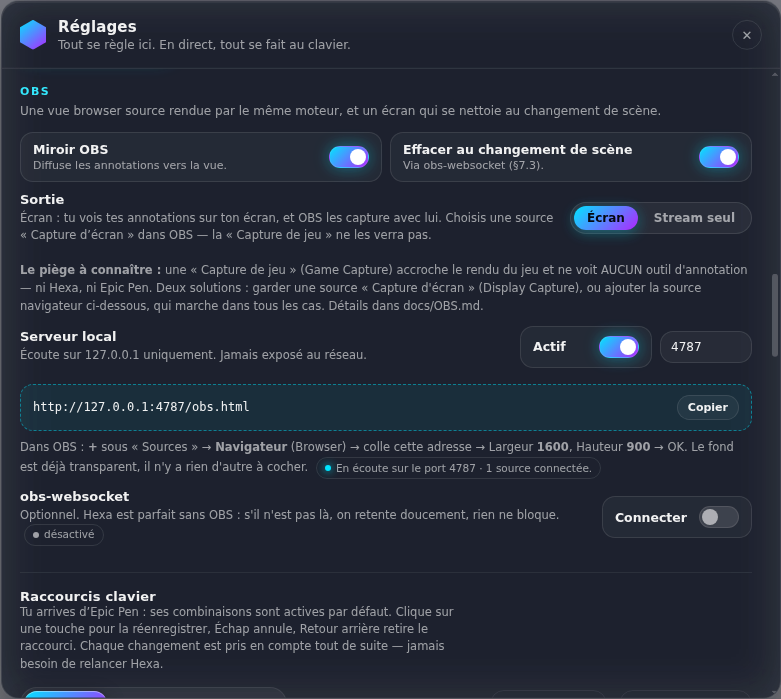
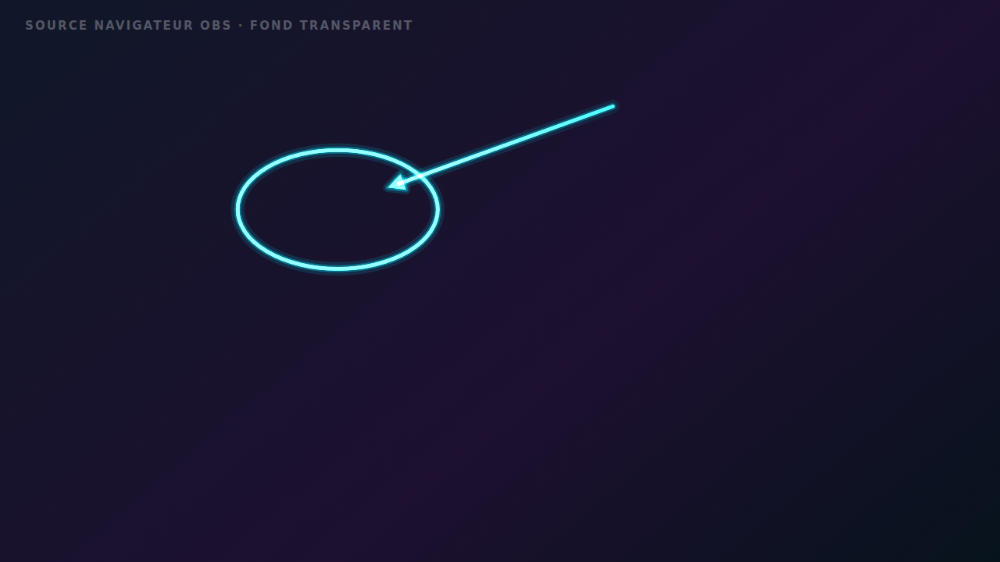

# Hexa dans OBS — le guide complet

> **La question à laquelle ce document répond :** « je dessine sur mon écran, est-ce que mes
> spectateurs le voient ? »
>
> **La réponse courte :** ça dépend **entièrement** de la source que tu as choisie dans OBS.
> Ce n'est pas un détail, c'est *le* piège qui fait échouer tous les outils d'annotation.
> Cinq minutes de lecture t'évitent une soirée à te demander pourquoi ton chat ne voit rien.

---

## 1. Le tableau qui décide de tout

| Ta source dans OBS (français) | Nom anglais | Tes annotations passent-elles à l'antenne ? |
| --- | --- | --- |
| **Capture d'écran** | Display Capture | ✅ **Oui.** Rien à configurer. |
| **Source navigateur** vers Hexa | Browser Source | ✅ **Oui**, quoi que tu captures par ailleurs. |
| **Capture de jeu** | Game Capture | ❌ **Non.** Voir l'explication ci-dessous. |
| **Capture de fenêtre** (du jeu) | Window Capture | ❌ **Non**, même raison. |

### Pourquoi la « Capture de jeu » ne verra jamais Hexa

Elle ne filme pas ton écran. Elle s'accroche **à l'intérieur du jeu** et récupère l'image juste
avant que le jeu ne l'envoie à Windows. À cet instant précis, rien de ce qui est posé par-dessus
n'existe encore : ni Hexa, ni l'overlay Discord, ni celui de Steam ou de GeForce Experience.

Aucun logiciel d'annotation ne contourne ça — **Epic Pen non plus**, et sa documentation dit
exactement la même chose. La différence, c'est qu'Hexa te donne une deuxième porte : la source
navigateur, qui rend le problème sans objet.

### Le cas qui trompe tout le monde : le plein écran exclusif

Si ton jeu tourne en **plein écran exclusif** (*Exclusive Fullscreen*), Windows lui donne l'écran
entier et **interdit toute couche par-dessus**. Tu ne verras même pas Hexa sur ton propre écran.

👉 Dans les options vidéo de ton jeu, choisis **Fenêtré sans bordure** (*Borderless Windowed*).
C'est le réglage standard de tous les streamers, il ne coûte quasiment aucune performance, et il
règle le problème pour Hexa comme pour tous les overlays.

---

## 2. Solution 1 — la capture d'écran (deux minutes, zéro réglage)

1. Dans OBS, panneau **Sources** → bouton **+** → **Capture d'écran** (*Display Capture*).
2. Choisis l'écran sur lequel tu dessines. Valide.
3. C'est fini. Dessine : les traits apparaissent dans l'aperçu d'OBS.

Si tu avais une **Capture de jeu**, garde-la ou remplace-la, mais mets la **Capture d'écran**
au-dessus dans la liste des sources (une source plus haut passe devant).

> **Méthode de capture :** dans les propriétés de la source, l'option **Méthode** (*Capture Method*)
> peut valoir « Automatique », « DXGI Desktop Duplication » ou « Windows 10 (1903 et plus) ».
> **Les trois conviennent** : toutes captent le bureau composé par Windows, donc Hexa avec.

---

## 3. Solution 2 — la source navigateur (celle que personne d'autre ne propose)

Hexa embarque un petit serveur local qui **rediffuse tes annotations dans OBS**, dessinées par
exactement le même moteur de rendu, sur fond transparent.

**Deux avantages énormes :**

- tes annotations passent **quelle que soit ta façon de capturer le jeu** — même en capture de jeu ;
- tu peux garder **ton écran totalement propre** : toi tu ne vois rien, tes spectateurs voient tout
  (voir le mode « Stream seul », plus bas).

### Marche à suivre

1. **Dans Hexa** : icône près de l'horloge → **Réglages…** → section **OBS**.
   Le **Serveur local** est **déjà actif** : tu n'as rien à allumer.
2. Une adresse est affichée, du genre `http://127.0.0.1:4787/obs.html`.
   Clique sur **Copier**.
   *(Prends bien celle affichée : si le port 4787 était occupé par un autre logiciel, Hexa est passé
   au suivant tout seul et l'adresse le reflète.)*
3. **Dans OBS** : panneau **Sources** → **+** → **Navigateur** (*Browser*).
4. Donne-lui un nom (« Hexa »), puis **OK**.
5. Dans la fenêtre de propriétés :
   - **URL** : colle l'adresse copiée ;
   - **Largeur** / **Hauteur** : mets **la taille de ta scène**, pas celle de ton écran.
     Le plus souvent **1920 × 1080** (c'est ce que dit Hexa sous l'adresse, il propose la bonne) ;
   - **CSS personnalisé** : laisse ce qu'il y a, ou vide, peu importe ;
   - ⬜ **Arrêter la source lorsqu'elle n'est pas visible** — *à laisser décoché* si la source vit
     dans une seule scène ; à cocher si tu veux qu'elle libère la mémoire hors scène (Hexa la
     remet à jour instantanément au retour) ;
   - ☑️ **Actualiser le navigateur lorsque la scène devient active** — *recommandé*. Hexa renvoie
     l'état complet à chaque rechargement : la source retrouve **immédiatement** les annotations
     déjà à l'écran, elle ne repart jamais vide.
6. **OK**. Redimensionne/positionne la source pour qu'elle couvre toute la scène
   (clic droit → **Transformer** → **Ajuster à l'écran**).

**Il n'y a rien à cocher pour la transparence** : la page ne peint aucun fond.
Pas de filtre « incrustation par chroma », pas de fond vert, rien.

### Vérifier que ça marche, avant le direct

Ouvre les **Réglages… → OBS** d'Hexa : sous l'adresse, une phrase dit la vérité en direct.

- « En écoute sur le port 4787 · **1 source connectée** » → tout est bon.
- « … · aucune source connectée pour l'instant » → OBS n'est pas branché : vérifie l'adresse.

Côté OBS, tant qu'Hexa n'a rien envoyé, la source affiche une petite carte d'attente qui te dit si
la connexion est établie. **Elle s'efface toute seule** au premier trait reçu, et de toute façon au
bout de 20 secondes : elle ne peut pas rester à l'antenne.

---

## 4. « Écran » ou « Stream seul » ?

Dans **Réglages… → OBS → Sortie** :

| Mode | Sur ton écran | Dans OBS | Quand l'utiliser |
| --- | --- | --- | --- |
| **Écran** *(défaut)* | tu vois tes annotations | via la capture d'écran **ou** la source navigateur | usage normal, tutoriels, analyse d'image |
| **Stream seul** | **rien**, ton écran reste propre | uniquement via la **source navigateur** | en jeu, ou pour entourer une information sans te la masquer |

Deux précisions honnêtes sur le mode **Stream seul** :

- la **barre d'outils** d'Hexa, elle, reste sur ton écran (c'est ta télécommande). Si tu captures
  aussi ton écran, masque-la avec **Ctrl+H** ;
- la loupe, le projecteur et le gel lisent ce qu'il y a *sur ton écran* : ce ne sont pas des
  annotations, ils ne partent pas dans la source navigateur.

⚠️ En **Stream seul**, tes annotations n'existent **que** dans la source navigateur.
Si aucune n'est connectée, la pastille en bas à droite de ton écran passe en orange et affiche
« Stream seul · aucune vue » : c'est le signal que tu dessines dans le vide. Choisir ce mode
allume automatiquement le miroir et le serveur local.

---

## 5. Plusieurs écrans

Hexa pose un overlay sur **chacun** de tes écrans. La source navigateur, elle, n'en montre qu'un —
sinon les annotations des deux écrans se superposeraient n'importe où dans ta scène.

**La règle : la source navigateur suit l'écran sur lequel tu dessines.**
Au démarrage, c'est ton écran principal ; dès que tu commences un trait sur l'autre écran, la vue
bascule sur celui-là et se met à jour entièrement. Rien à régler.

**Résolutions différentes ?** C'est prévu : Hexa envoie la taille de l'écran annoté, et la vue met
tout à l'échelle de ta scène en conservant les proportions. Un écran 2560 × 1440 mirroité dans une
scène 1920 × 1080 tient entièrement dedans, sans décalage et sans cercle aplati.

---

## 6. Effacer l'écran au changement de scène (obs-websocket)

Hexa peut se brancher sur OBS pour **effacer toutes les annotations quand tu changes de scène**.
Tu passes de « gameplay » à « écran de fin » : c'est déjà propre.

**Côté OBS :**

1. Menu **Outils** (*Tools*) → **Paramètres du serveur WebSocket** (*WebSocket Server Settings*).
2. Coche **Activer le serveur WebSocket** (*Enable WebSocket server*).
3. Note le **port** (4455 par défaut).
4. Si **Activer l'authentification** est coché, clique sur **Afficher les informations de connexion**
   (*Show Connect Info*) et copie le **mot de passe**.

**Côté Hexa :** **Réglages… → OBS → obs-websocket** → interrupteur **Connecter**, puis renseigne
l'hôte (`127.0.0.1`), le port et le mot de passe.

L'indicateur dit où on en est : *connexion…*, *authentification…*, **connecté**,
*hors ligne, nouvelle tentative*, ou **mot de passe refusé par OBS** (dans ce dernier cas, Hexa
arrête de réessayer et attend que tu corriges — inutile de marteler OBS avec un mot de passe faux).

Le mot de passe ne sert **qu'**à calculer l'empreinte d'authentification exigée par OBS. Il n'est
jamais écrit dans le journal d'Hexa, jamais envoyé ailleurs qu'à ton OBS local.

**Tout ceci est facultatif.** Sans OBS lancé, Hexa fonctionne exactement pareil : il retente
tranquillement en arrière-plan, sans un message d'erreur, sans un ralentissement.

---

## 7. Sécurité et réseau — ce qui est fait, et pourquoi

Le serveur d'Hexa est le genre de chose qu'il faut faire sérieusement : il diffuse **ce que tu
annotes**, donc potentiellement ce que tu lis à l'écran.

- **Écoute sur `127.0.0.1` uniquement.** C'est « cet ordinateur, et personne d'autre ». Ni ton
  réseau, ni ton wifi, ni Internet. Un voisin connecté à la même box ne peut pas s'y brancher.
- **Aucune alerte du pare-feu Windows** : une écoute limitée à la boucle locale n'en déclenche pas.
  Si un pare-feu tiers te demande quelque chose, tu peux refuser l'accès **public** sans rien casser.
- **Contrôle de l'en-tête `Origin`** : un site web ouvert dans ton navigateur **ne peut pas** se
  connecter au flux pour lire tes annotations (les WebSockets ignorent les protections habituelles ;
  sans ce contrôle, n'importe quel onglet ouvert pourrait écouter).
- **Contrôle de l'en-tête `Host`** : bloque l'astuce du domaine qui pointe vers 127.0.0.1
  (*DNS rebinding*).
- **Sens unique.** Le seul message qu'une source a le droit d'envoyer est « envoie-moi tout ».
  Rien venu du réseau ne peut piloter Hexa, ni dessiner, ni effacer.
- **Port occupé ?** Hexa essaie 4787, puis 4788, 4789, 4790, 4791, et affiche l'adresse réellement
  utilisée. Tu peux aussi fixer le port toi-même dans les réglages.
- **Coût au repos : zéro.** Aucune minuterie, aucune boucle. Quand tu ne dessines pas, rien ne
  tourne — ni côté Hexa, ni dans la source navigateur d'OBS.

---

## 8. Ça ne marche pas — le tableau de dépannage

| Ce que tu vois | Ce qui se passe | Ce qu'il faut faire |
| --- | --- | --- |
| Rien à l'antenne, mais tout va bien sur mon écran | Tu captures le jeu, pas l'écran | Ajoute une **Capture d'écran**, ou la **source navigateur** (§3) |
| Je ne vois même pas Hexa sur mon écran | Jeu en **plein écran exclusif** | Passe le jeu en **fenêtré sans bordure** |
| La source navigateur reste blanche/vide | Mauvaise adresse, ou Hexa fermé | Recopie l'adresse depuis **Réglages… → OBS** (le port a pu changer) |
| « En attente d'Hexa » dans OBS | La page ne joint pas Hexa | Hexa est-il lancé ? (icône près de l'horloge). Adresse exacte ? |
| Les annotations sont décalées / trop petites | Taille de la source ≠ taille de la scène | Clic droit sur la source → **Transformer** → **Ajuster à l'écran** |
| Mon écran est propre mais OBS aussi | Mode **Stream seul** sans source connectée | Repasse en **Écran**, ou ajoute la source navigateur |
| La source ne se met à jour qu'après un trait | Elle a été ouverte avant Hexa | Rien à faire : elle se resynchronise seule à la connexion |
| obs-websocket : « mot de passe refusé » | Mot de passe erroné | OBS → **Outils → Paramètres du serveur WebSocket → Afficher les informations de connexion** |
| Deux écrans : la vue montre le mauvais | Elle suit l'écran où tu dessines | Trace un trait sur le bon écran : la vue bascule |

Si rien n'y fait, le journal d'Hexa raconte ce qui s'est passé :
**Réglages… → À propos → Ouvrir le dossier du journal** (`%APPDATA%\Hexa\hexa.log`).
Toutes les lignes du serveur OBS y sont horodatées.

---

## 9. Pour les curieux : comment ça marche

- Un serveur **HTTP + WebSocket** tourne dans le processus principal d'Hexa (aucune dépendance
  externe : la poignée de main WebSocket est écrite à la main, ~200 lignes).
- Il sert `obs.html` et diffuse l'état d'annotation en **JSON typé** : `state:full` à la connexion,
  puis `stroke:add`, des **lots de points à ~30 Hz** (jamais un message par point), `stroke:update`,
  `stroke:remove`, `clear`, `viewport`.
- La page OBS rejoue ces messages avec **le même code de rendu** que l'overlay
  (`src/engine/render.ts` via `src/replay/paint.ts`) : même néon, mêmes dissolutions, mêmes formes.
- Sa boucle d'animation est **dormante** : elle s'allume quand quelque chose bouge et s'éteint dès
  que l'image est stable.

Fichiers concernés : `electron/obs-server.ts`, `src/obs/` (protocole, émetteur, miroir, vue, client
obs-websocket), `obs.html`.
